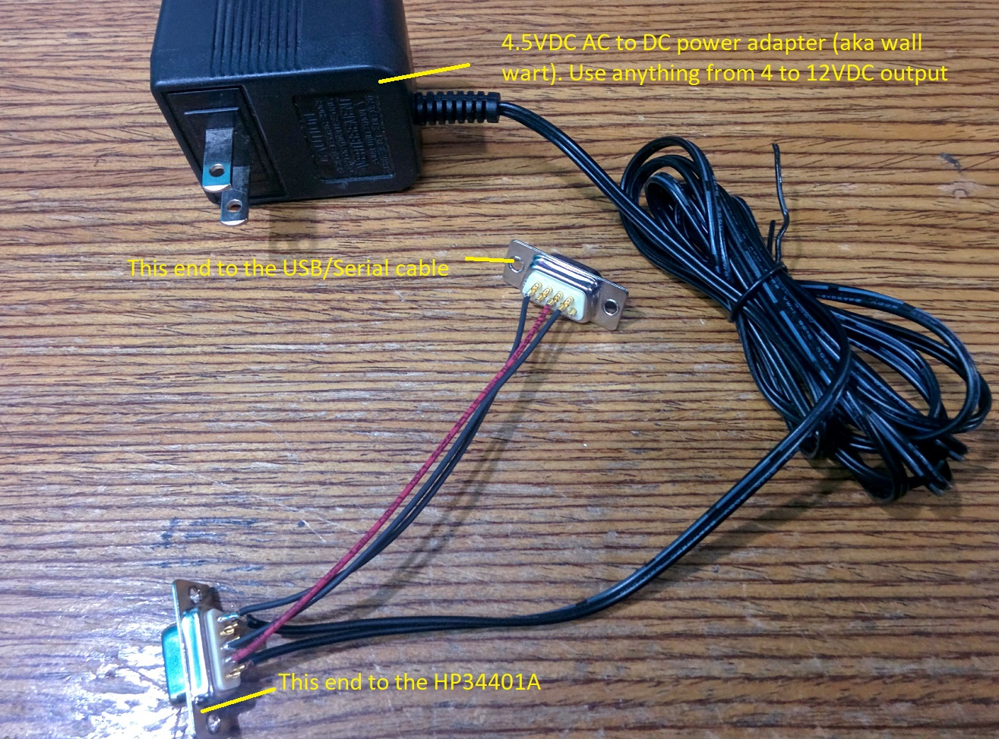

# HP34401A
Python Class to support utilizing the HP34401A Digital multimeter 
## Project Origin
This project came about when I needed to automate my HP34401A to read current over a number of days. I found a github project that supported the HP34401A but later discovered that the code didnt work well and was limited in its functionality. 
## Capabilities
* Class module so multiple instantiations possible
* configure mode to take multiple samples per sample request
* measurements returns as a string with commas separating individual measuresments
  * example:  -0.34343430E-02,+1.74000000E+01\n\r
* Currently supports the following measurement modes:
  * Current AC, DC
  * Voltage AC,DC
  * Resistance 2 wire, 4 wire
  * Frequency
  * Period
  * Continuity 
* display text information to front panel display

additional features to be added long term

## Python Modules
The HP34401A module needs _PySerial_  python module
Drop the HP34401A.py module into your python modules folder
Look at the __main__.py for example code, 
create the class object, configure for the kind of measurement you desire to make, and call object.get_sample()

## Hardware
The HP34401A utilizes dsr/dtr hardware handshaking to work correctly, for you this means you need to apply approximately 4VDC to 12VDC between Pins 6 (dsr), pin 5 (gnd). See the diagram below. 
You can do this by using any wall wart with voltage output that is between those two ranges..
The overall cabling consists of the following pieces 
* usb to serial cable (from your pc)
* a serial cable standard DCE to DTE
* a null modem (which you make) wired as shown in 
### Hardware, the null modem
To make the null modem you will need 
* 2 female DB-9 connectors
* A wall wart (AC to DC power adapter) any voltage from 4 to 12 VDC output should work.
* some hook up wire
* some simple soldering skills

Wire the two DB-9s as shown in the diagram. 
Also see the image file of the null modem 
The power supply should have the postive voltage on pin 6 with ground on pin 5.
Make sure you connect the DB-9 with the power adapter toward the HP34401A serial port, ie the HP34401A needs to have the DSR signal (high) to operate correctly.
## Current Files
* __main__.py is the test driver
* HP34401A.py is the class file
* sample_and_save.py is a program I wrote to continously capture and save measurements. It utilizes the HP34401A.py module/class
* DMM33401A.py is the original continous capture and save measurement python script (non class based). I keep it as a reference. 
